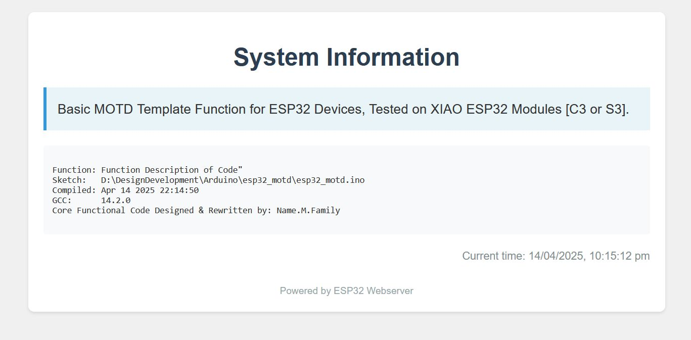

# ESP32-MOTD
 A basic MOTD template for ESP32 devices.
 
 Tested with the following dependancies.
 esp32\3.2.0\libraries\WiFi.
 esp32\hardware\esp32\3.2.0\libraries\WebServer.
 Using library WiFi at version 3.2.0.
 Using library Networking at version 3.2.0.
 Using library WebServer at version 3.2.0.
 Using library FS at version 3.2.0.
 

